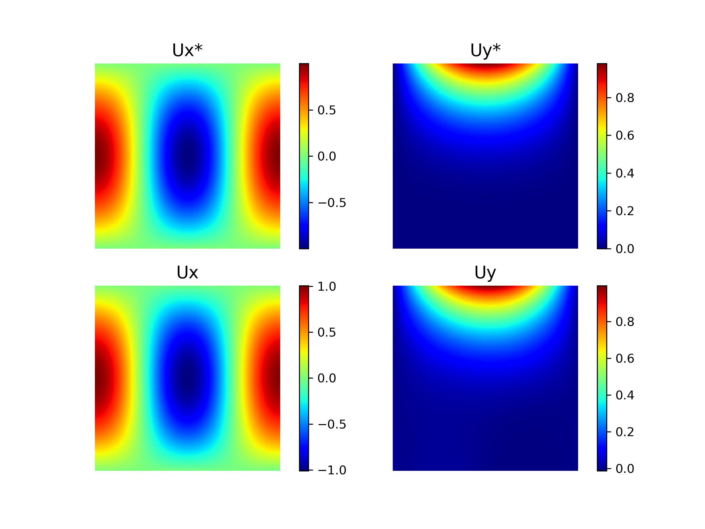
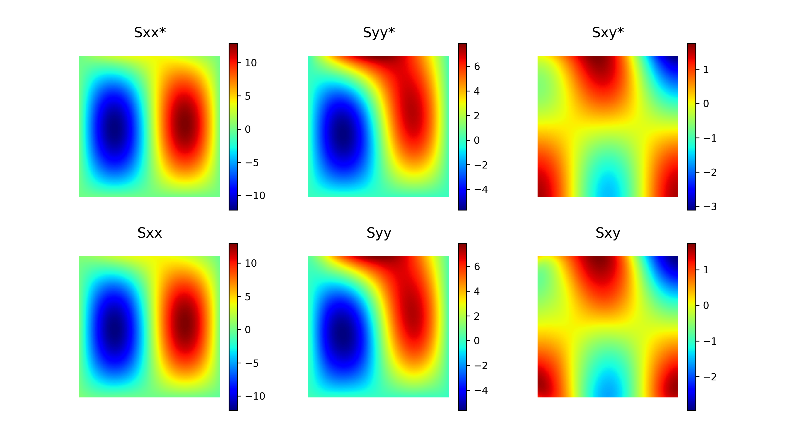
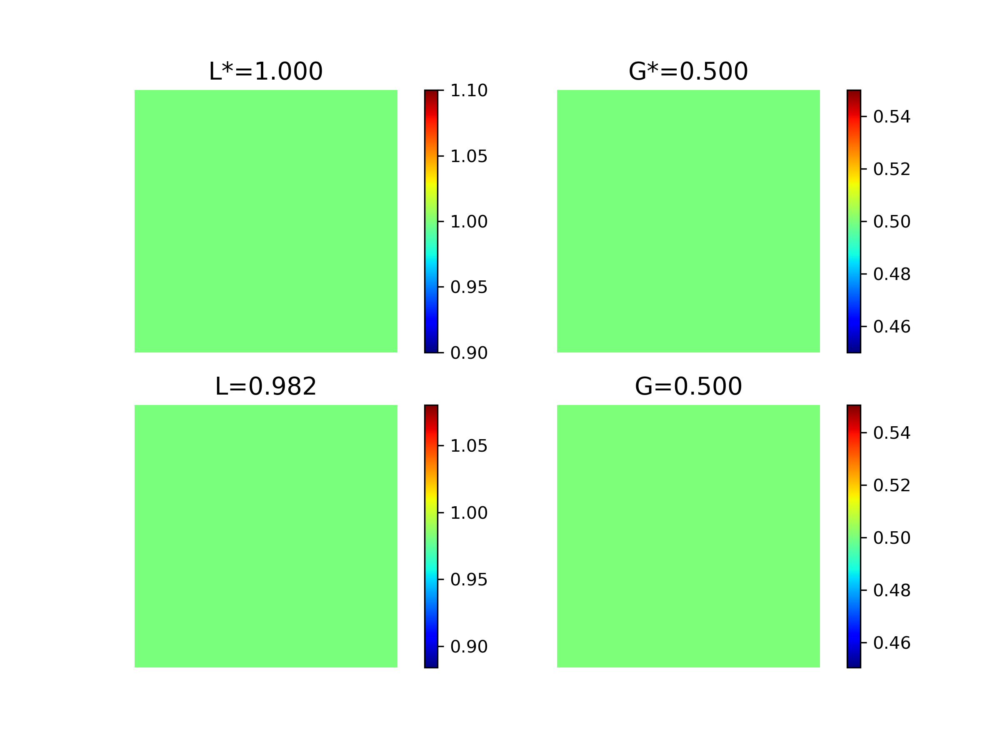
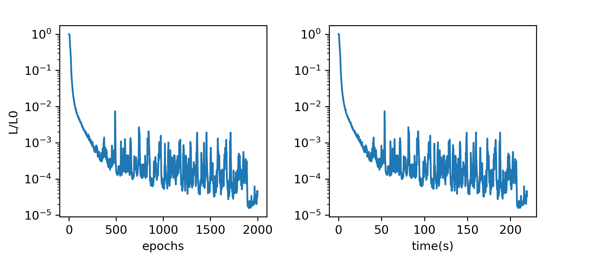

# Physics-Informed Neural Networks for Solution and Discovery in Solid Mechanics 

Here, we demonstrate how to use [SciANN](www.sciann.com) to discover (invert) parameters of a data-set satisfying solid mechanics equations. Inversion is computationally an intensive task that requires many forward simulations and for most problems, it is intractable. For some problems it is even mathematically non-unique. PINN allows to incorporate physics in the neural network during training, therefore, one can invert the parameters of a data-set the same time as fitting a NN to the data. For additional details, check out our paper: [https://arxiv.org/abs/2003.02751](https://arxiv.org/abs/2003.02751)

## How to use this code: 

You first need to have SciANN installed in your % python environment: https://www.sciann.com/#installation

The version that this example is prepared on is `sciann==0.4.3`. To run the code, using default settings, call:

```terminal
% python SciANN-SolidMechanics.py
```

Once the training is completed, you may call `--plot` to get the outputs: 

```terminal
% python SciANN-SolidMechanics.py --plot 
```

The displacement field is: 



where (Ux, Uy) components with `*` superscripts are true values and others are network predictions. The stress field will be as: 


And most importantly, the parameters of the system, i.e., the lame parameters `L` and `G`, are identified as: 


And the convergence of the total loss is: 


## Parameters of the model 

Associated to a neural network and the optimization algorithm to train the network, there are many parameters to adjust, including:

- Number of layers 
- Number of Neurons 
- Activations function 
- Optimization parameters such as `batch size`, `number of epochs`, etc

Such parameters and many more can be set through the python call. Check the `--help` for available parameters through the interface: 

```terminal
% python SciANN-SolidMechanics.py --help


optional arguments:
  --help            show this help message and exit
  --layers          Num layers and neurons (default 4 layers each 40 neurons [40, 40, 40, 40])
  --actf            Activation function (default tanh)
  --numx            Num Node in X (default 40)
  --numy            Num Node in Y (default 40)
  --batchsize       Batch size for Adam optimizer (default 32)
  --epochs          Maximum number of epochs (default 2000)
  --learningrate    Initial learning rate (default 0.001)
  --verbose         Show training progress (default 2) (check Keras.fit)
  --shuffle         Shuffle data for training (default True)
  --stopafter       Patience argument from Keras (default 500)
  --savefreq        Frequency to save weights (each n-epoch)
  --dtype           Data type for weights and biases (default float64)
  --gpu             Use GPU if available (default False)
  --outputpath      Output path (default ./file_name)
  --outputprefix    Output path (default res**)
  --numxplot        Num Node in X for ploting final results (default 200)
  --numyplot        Num Node in Y for ploting final results (default 200)
  --plot            Plot the model
  --independent_networks   Use independent networks for each var (default True)
```

In this example, the analytical solution is given. Therefore, you can generate any arbitrary size of data set (training data) through `--numx` and `--numy` variables.

Note that the convergence curve you get may not be the same as what posted here, as the initial state of Neural Network is random. If you have questions, feel free to contact me. 

